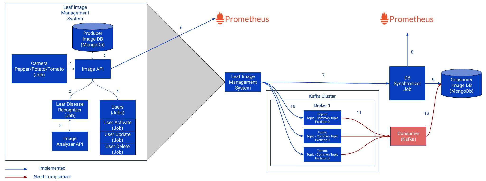

# CC Assignment 2

# Services



The detailed information about system architecture can be found in the report/cc_assignment_2_overview.pdf file.

## APIs

### Image API

located: basic_services/api/image_api

### Image Analyzer API

located: basic_services/api/image_analizer_api

## Jobs

### Camera

### Leaf Disease Recognizer

### Users

### Db Synchronizer

## Databases

### Consumer Db

### Producer DB

# Deployment Instructions

Locally:

1. Install minikube
2. Start minikube
3. Run the following script: basic_services/start.stg.sh
<pre>

```
sh start.stg.sh
```

</pre>

4. Wait 2-3 minutes until all pods are running and the all the data has been loaded into the databases
5. You can expose the ports of all services using the foolowing script: open.stg.sh

<pre>

```
sh open.stg.sh
```

</pre>

Each service has been deployed with ClusterIP type:

- image_api: 30001
- image_analizer_api: 30002
- camera: 30003
- leaf_disease_recognizer: 30004
- users: 30005
- db_synchronizer: 30006
- consumer_db: 30007
- producer_db: 30008

Cloud:

#

# Delete Instructions

Locally:

1. Run the following script: basic_services/stop.stg.sh:

<pre>

```
sh stop.stg.sh
```

</pre>

Describe stg/prod

Describe how to stop

Describe what to do
